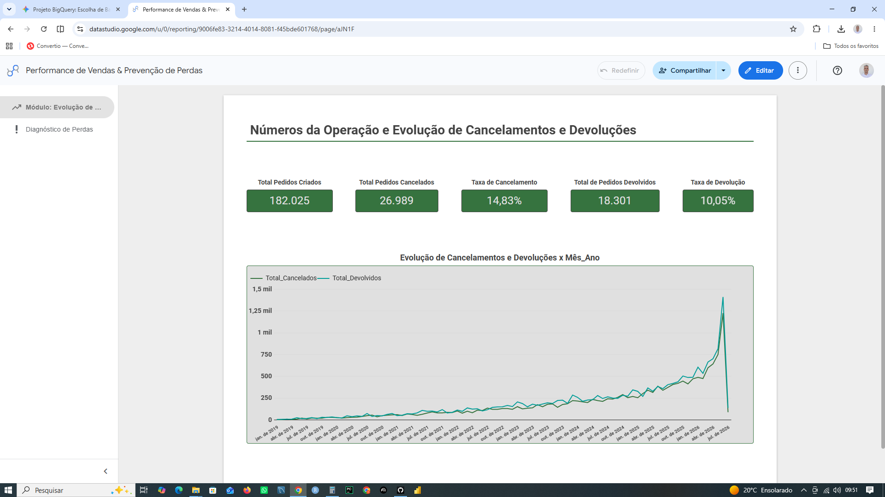
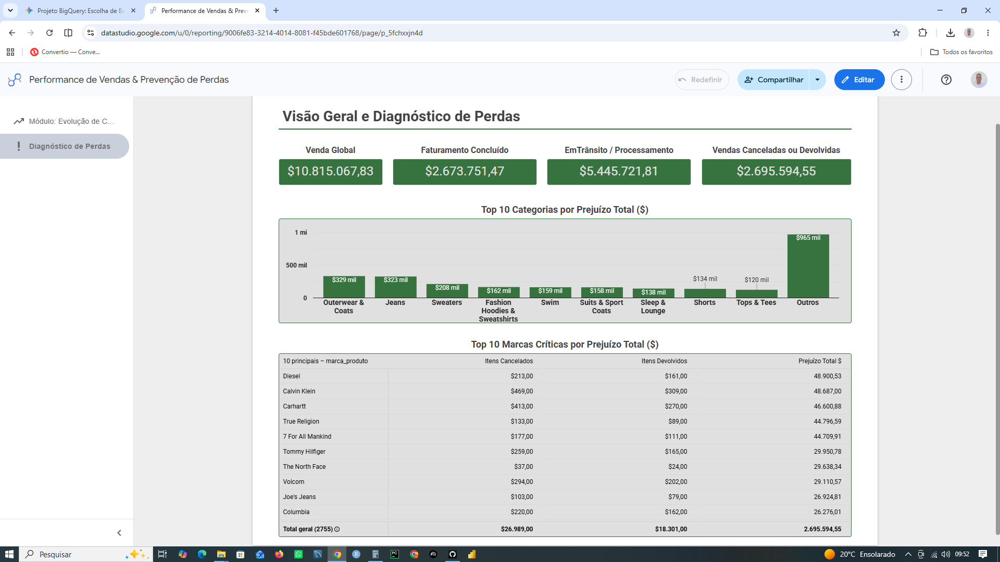

# 📊 Visão Geral e Diagnóstico de Perdas - E-commerce TheLook

Este projeto apresenta um ecossistema completo de Business Intelligence (BI) e Engenharia de Dados focado no monitoramento financeiro e no diagnóstico de atrito (perdas por cancelamentos e devoluções) em um e-commerce global. 

A solução integra uma pipeline de tratamento em **Python**, armazenamento de alta performance em **Google BigQuery** e um dashboard estratégico interativo no **Looker Studio**.

---

## 🛠️ Tecnologias Utilizadas

* **Linguagem Principal:** Python 3 (com bibliotecas de integração de nuvem)
* **Data Warehouse:** Google BigQuery (Google Cloud Platform - GCP)
* **Visualização de Dados:** Looker Studio
* **Ambiente de Desenvolvimento:** VS Code / Google Colab

---

## 📐 Arquitetura do Ecossistema de Dados

1. **Extração & Carga:** Extração de tabelas de pedidos (`order_items`) e cadastro de produtos (`products`) da base pública global *TheLook eCommerce*.
2. **Transformação & Regras de Negócio (Python):** Script automatizado em Python que valida e reconstrói as views no BigQuery, aplicando as regras financeiras e calculando as flags de atrito por item.
3. **Modelagem de Dados:** Cruzamento analítico (`LEFT JOIN`) para mapear comportamento de compra por categorias e fornecedores específicos.
4. **Camada de Consumo:** Conexão direta via conector nativo do BigQuery para alimentação em tempo real do Looker Studio.

---

## 💼 Regras de Negócio e Métricas Implementadas

Para garantir a auditoria de fluxo de caixa da empresa, as vendas globais foram segmentadas em quatro estágios operacionais distintos:

* **Venda Global:** Todo o volume financeiro transacionado no site.
* **Faturamento Concluído:** Receita real e garantida (pedidos com status `Complete`).
* **Faturamento em Trânsito / Processamento:** Capital em carteira dependente de fluxo logístico (status `Shipped` e `Processing`).
* **Vendas Canceladas e Devolvidas (Atrito):** O prejuízo real (pedidos com status `Cancelled` e `Returned`).

---

## 📈 Resultados e Validação Financeira (Auditoria dos Dados)

A validação matemática dos dados no encerramento deste projeto apresentou os seguintes resultados macro:

| Indicador | Status do Pedido | Valor ($ USD) | Impacto (%) |
| :--- | :--- | :--- | :--- |
| **Venda Global** | *Todos* | **$ 10.815.067,83** | 100,0% |
| **Faturamento Concluído** | `Complete` | **$ 2.673.751,47** | 24,7% |
| **Em Trânsito / Proc.** | `Shipped`, `Processing` | **$ 5.445.721,81** | 50,4% |
| **Prejuízo (Atrito Total)** | `Cancelled`, `Returned` | **$ 2.695.594,55** | 24,9% |

> **Equação de Fechamento Auditada:**
> Faturamento Concluído ($2.673.751,47) + Em Trânsito ($5.445.721,81) + Atrito Total ($2.695.594,55) = **Venda Global ($10.815.067,83)**. 
> *A acurácia dos dados fecha em 100% no centavo.*

---

## 🧠 Painel Visual (Looker Studio)

O dashboard foi estruturado em duas páginas principais utilizando um framework de análise macro-para-micro:

### Página 1: Números da Operação e Evolução de Cancelamentos e Devoluções
* Linha de KPIs executivos com os 4 cartões de fluxo financeiro auditados.
* Análise temporal de picos históricos de faturamento e taxas de conversão de pedidos saudáveis.

<p align="center">
  
</p>

### Página 2: Visão Geral e Diagnóstico de Perdas
* **Top 10 Categorias com Maior Atrito Financeiro:** Gráfico de colunas ordenado de forma decrescente pelo prejuízo absoluto, revelando as categorias onde a operação mais queima margem de lucro.
* **Ranking de Atrito por Fornecedor (Marca):** Tabela analítica com paginação detalhando o volume físico (`Itens Cancelados` e `Itens Devolvidos`) cruzado com o `Prejuízo Total ($)` por marca, servindo como ferramenta direta para renegociação de contratos pelo setor de compras.

<p align="center">
  
</p>

---

## 🚀 Como Executar o Script de Atualização

Caso queira replicar ou forçar a atualização da estrutura no BigQuery, execute o script de automação:

```bash
# Certifique-se de ter as credenciais do GCP configuradas no terminal
python atualiza_view_p2.py
